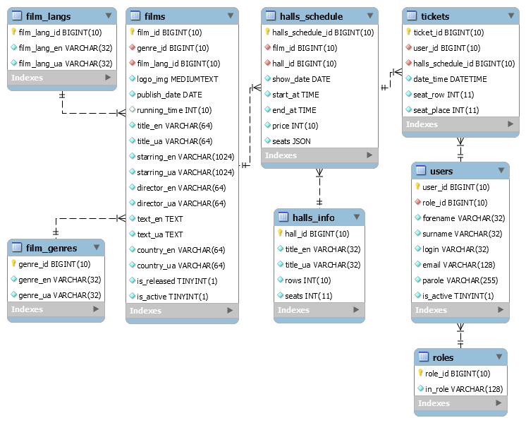

# WhiteBlack cinema project

### Description

A cinema project written in Java which has three access roles (currently one user role). Involves viewing the film 
descriptions, schedule and purchasing depending on the role. The site has two languages: English and Ukrainian.

### Technologies

The following key technologies were used:
* Java 11
* JavaScript
* Spring Boot 2
* MySQL
* Thymeleaf
* Bootstrap 4

### Installation

Project setup is extremely simple. All you need to do is unzip the database, create it and execute the second file to 
fill this database, for the _halls_schedule_ table, you need to change the time data. Also set the project encoding to 
**UTF-8**, for **IntelliJ IDEA**, select **File => Settings => Editor => File Encodings**.

### Database

The database has the following structure:

>

The _halls_schedule_ table, namely the _seats_ field, deserves special attention. It is a JSON object that has the 
following structure:
```json
[
  {"row" : 1, "seat" : 1, "occupied" : false},
  {"row" : 1, "seat" : 2, "occupied" : false},
  ...
]
```
and stores information about places in the cinema.

### Preview

Home page for anonymous user with descriptions of films:

>.png)

Home page for authorized user with movie schedule:

>.png)

Cinema hall named Light:

>.png)